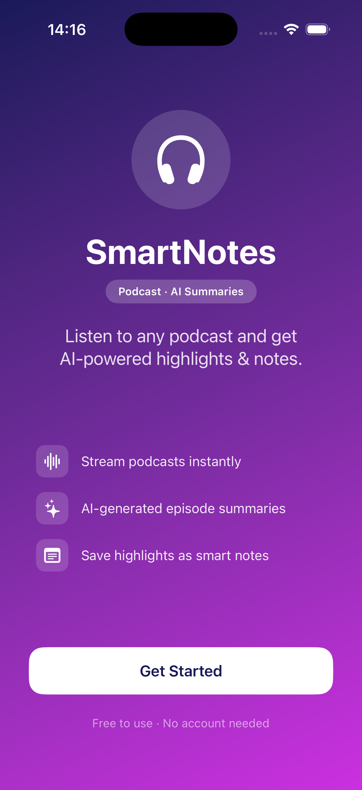
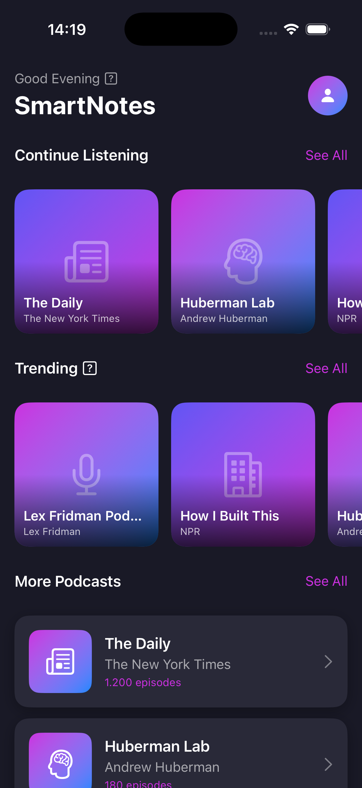
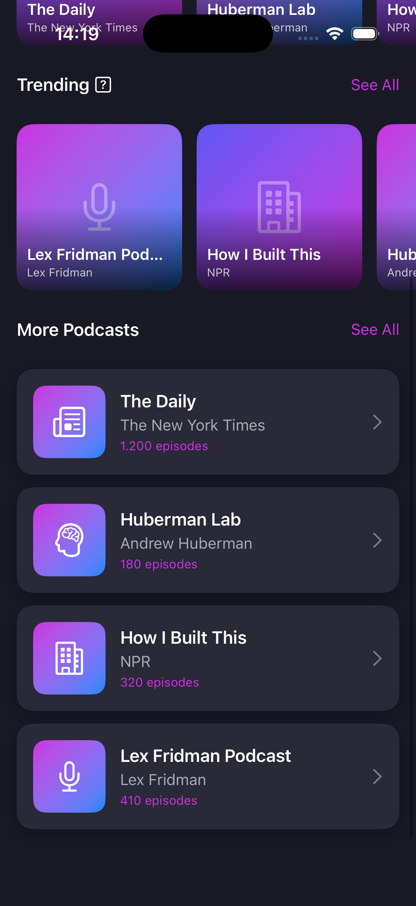

# SmartNotes

SmartNotes is a Swift-based iOS app (MVP) for podcast listeners who want to **remember and use what they hear**.

The core idea is simple: listen to podcasts, get transcripts, capture highlights, generate summaries, and turn important ideas into notes you can revisit.

## App Screenshots

| Landing Page | Home - Continue Listening & Trending | Home - More Podcasts |
|---|---|---|
|  |  |  |

---

## Why this app exists

This project started from a real problem:

- Podcasts and videos often contain valuable insights
- It is hard to remember all key takeaways later
- Manual note-taking while listening is slow and distracting

SmartNotes is being built as a practical solution for that.

---

## MVP Scope (Current Focus)

The MVP focuses on podcast workflows:

- Browse and access podcast content
- Generate or retrieve podcast transcripts
- Extract key highlights from episodes
- Summarize the content
- Create personal notes from the summary/highlights

> Status: In active development. The project is ongoing, and work is currently focused on building a suitable API integration for podcast data.

---

## Future Roadmap

After podcast support is stable, SmartNotes will expand to video support:

- Provide a video link
- Generate transcript from the video
- Extract highlights
- Summarize key points
- Save notes from video content, similar to podcasts

---

## Tech Stack

- **Language:** Swift
- **Platform:** iOS
- **UI Framework:** SwiftUI
- **Project Type:** MVP / iterative product development

---

## Project Structure

High-level folders in this repository:

- `SmartNotes/` – app source code
- `Models/` – data models (`Podcast`, search results, etc.)
- `Views/` – SwiftUI views (`HomeView`, `LandingPageView`, `PodcastCardView`)
- `ViewModels/` – presentation/business logic (in progress)
- `SmartNotesTests/` – unit tests
- `SmartNotesUITests/` – UI tests

---

## Getting Started

1. Open `SmartNotes.xcodeproj` in Xcode
2. Select an iOS simulator (or physical device)
3. Build and run the app

---

## Current Development Notes

- MVP-first development
- API integration for podcast connection is currently being implemented
- Features and architecture will evolve as podcast flow is stabilized

---

## Vision

SmartNotes aims to become a learning companion that helps users:

- consume long-form audio/video content,
- retain key information,
- and transform insights into actionable personal notes.

